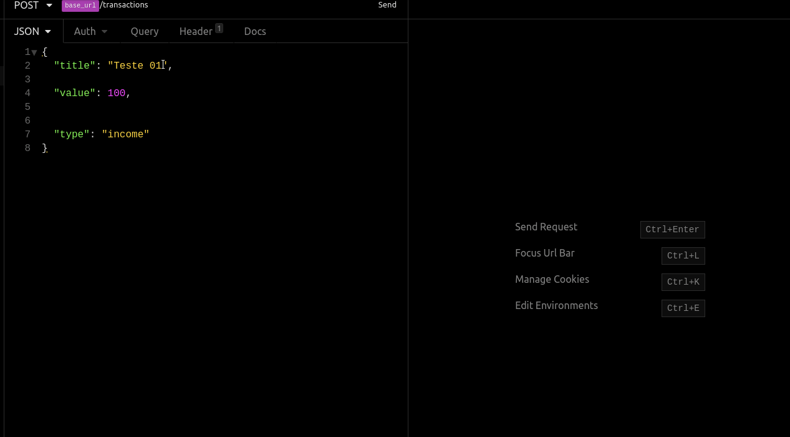
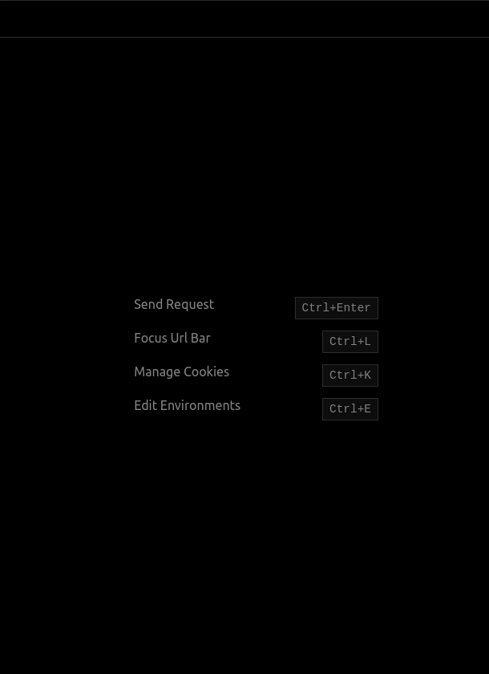
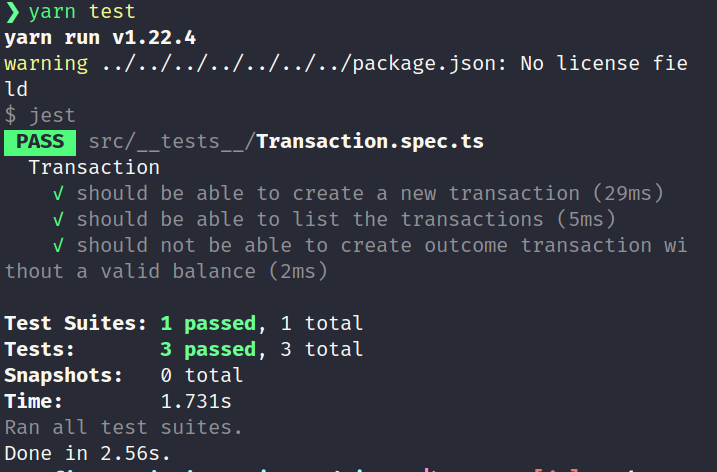

# Desafio 05 - Primeiro Projeto Node.js

> Projeto Aplicado pela rocketseat durante o bootcamp Gostack 11 .

## Sobre o Desafio

Nesse desafio,  foi necessário criar uma aplicação para continuar treinando o que foi aprendido até agora no Node.js junto ao TypeScript, utilizando o conceito de models, repositories e services!

Essa é uma aplicação para que deve armazenar transações financeiras de entrada e saída, que deve permitir o cadastro e a listagem dessas transações.

## :exclamation: Dependências do projeto

> :thumbsup: Dependencias de Desenvolvimento.

```json
"devDependencies": {
    "@types/express": "^4.17.5",
    "@types/jest": "^25.2.1",
    "@types/supertest": "^2.0.8",
    "@typescript-eslint/eslint-plugin": "^2.27.0",
    "@typescript-eslint/parser": "^2.27.0",
    "eslint": "^6.8.0",
    "eslint-config-airbnb-base": "^14.1.0",
    "eslint-config-prettier": "^6.10.1",
    "eslint-import-resolver-typescript": "^2.0.0",
    "eslint-plugin-import": "^2.20.1",
    "eslint-plugin-prettier": "^3.1.2",
    "jest": "^25.3.0",
    "prettier": "^2.0.4",
    "supertest": "^4.0.2",
    "ts-jest": "^25.3.1",
    "ts-node-dev": "^1.0.0-pre.44",
    "typescript": "^3.8.3"
  },

```

 > :thumbsup: Dependencias de produção.

 ```json
 "dependencies": {
    "express": "^4.17.1",
    "uuidv4": "^6.0.7"
  }

 ```

## :ok_hand: Exemplo de uso

- **POST /transactions**: A rota deve receber title, value e type dentro do corpo da requisição, sendo type o tipo da transação, que deve ser income para entradas (depósitos) e outcome para saidas (retiradas)..



- **GET /transactions:** Essa rota deve retornar uma listagem com todas as transações que você cadastrou até agora, junto com o valor de soma de entradas, retiradas e total de crédito.

- **Dentro de balance**, o income é a soma de todos os valores das transações com type income. O outcome é a soma de todos os valores das transações com type outcome, e o total é o valor de income - outcome.



## Configuração para Desenvolvimento

- Basta utilizar o gerenciador de pacotes para instalar todas as dependências do projeto.

```sh
yarn || npm

```

### Sobre a API

- A **API** utiliza  a porta `3333` para se conectar ao servidor.

```json
"http://localhost:3333",

```

- Para executar os testes utilize um dos comandos abaixo:

```sh

npm test ou yarn test
```



## :v: :v: Meta

Talita Azevedo – [Github - tnazevedo](https://github.com/tnazevedo/) – talita.azevedo360@gmail.com

## :star: :star: :star: Contributing

1. Faça o _fork_ do projeto [`Clique aqui :v:`](https://github.com/tnazevedo/Desafio05-PrimeiroProjetoNodejs/fork)
2. Crie uma _branch_ para sua modificação (`git checkout -b feature/fooBar`)
3. Faça o _commit_ (`git commit -am 'Add some fooBar'`)
4. _Push_ (`git push origin feature/fooBar`)
5. Crie um novo _Pull Request_.
